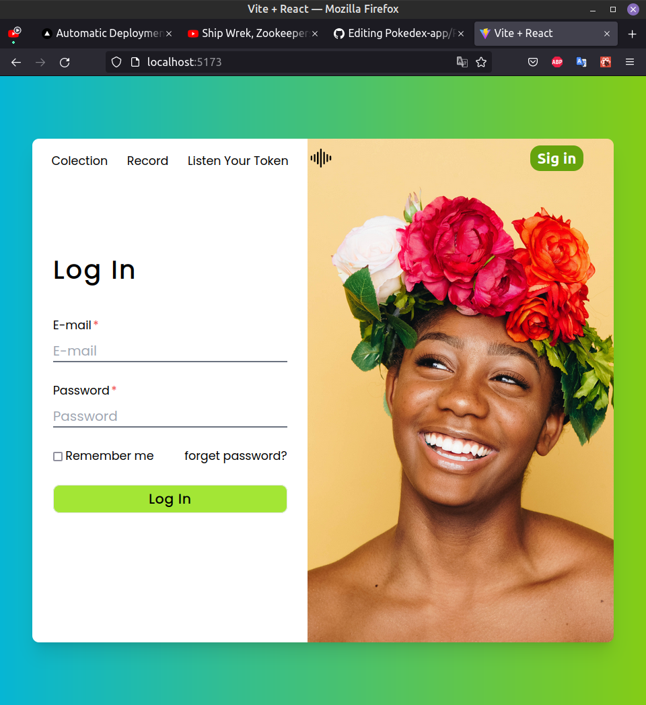
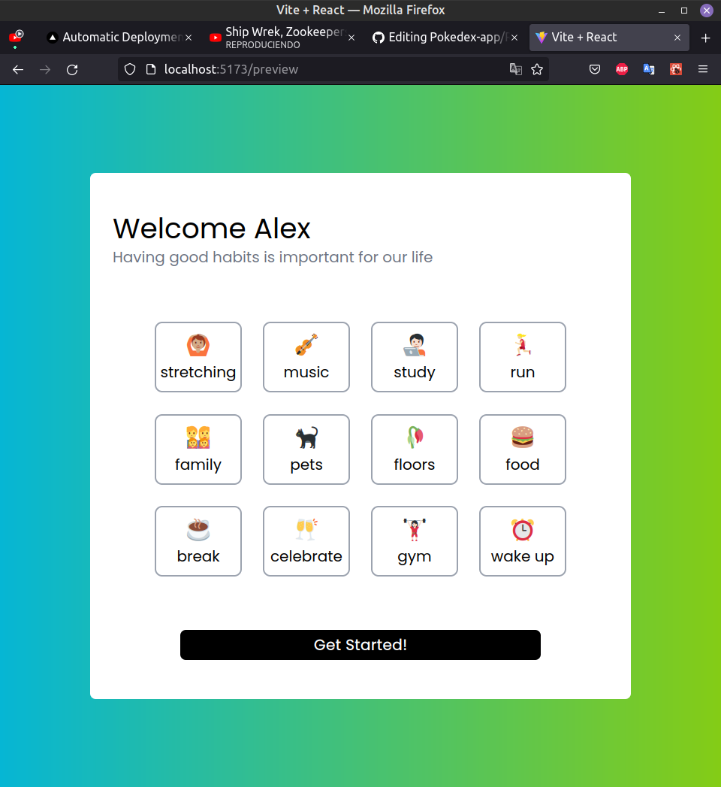
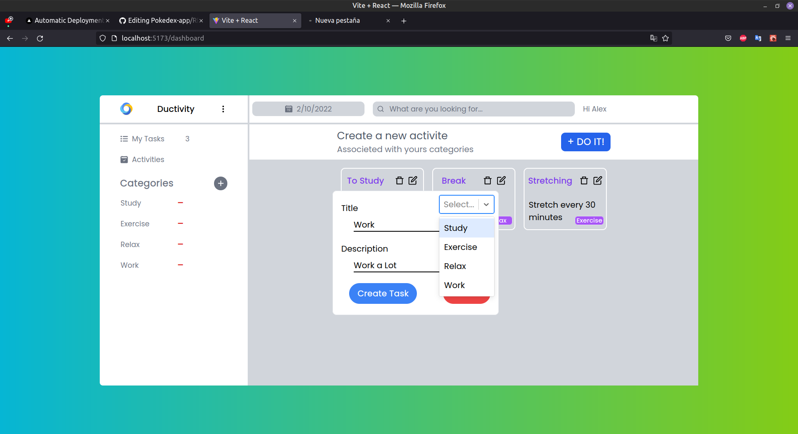

# Ducktivity

It is an application that records your activities, associating them to a category, where you can see, delete, add and edit your activities associating them to a category.

It has: Login, registration and logout, using session storage.

---

## Technologies

A list of technologies used within the project:

- [Tailwind](https://vitejs.dev/): Version 3.0.24
- [Vite](https://tailwindcss.com/): Version 2.9.9
- [React.js](https://es.reactjs.org/) : Version 18
- [React router dom](https://reactrouter.com/en/v6.3.0/getting-started/overview) : Version 6.3
- [React select](https://react-select.com) : Version 5.4
- [React icons](https://react-icons.github.io/react-icons/) : Version 4.4

---

### ScreenShot





## Installation

---

A little intro about the installation.

```
git clone https://github.com/Dalex19/-TaskList-AppV2.git
cd app-test
npm install or npm i
npm run dev
visit http://localhost:5173/
```
